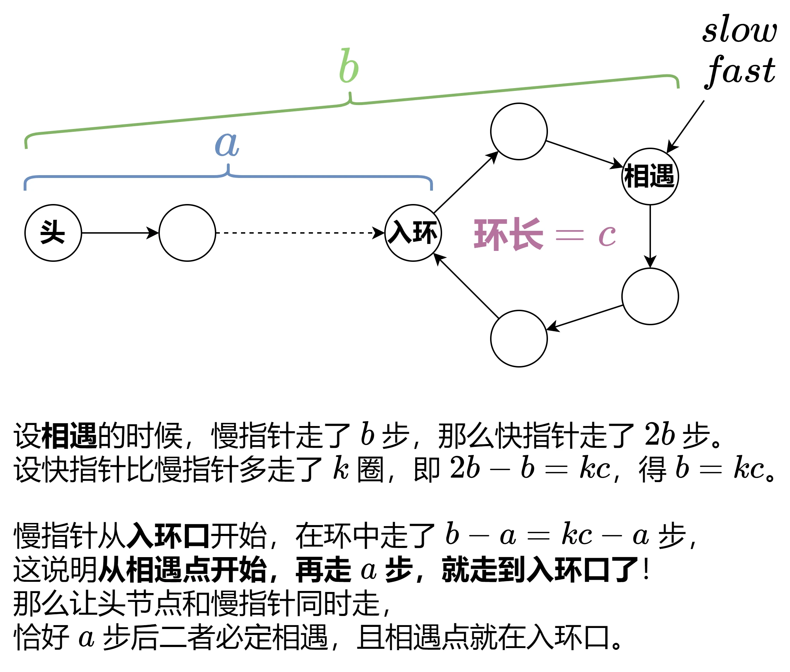
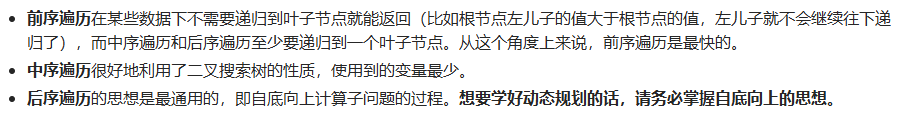
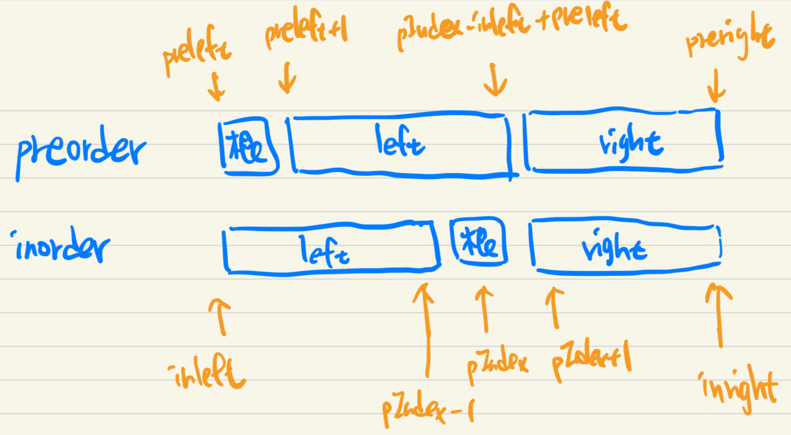

# LeetCode
## Note
### Prefix Sum
* 可以將 PrefixSum 陣列大小設為 n + 1，這樣就不用考慮 edge case 的情況 (e.g. 當 left = 0 時)
* ```c++
    // initialization
    for (int i = 0; i < n; i++) {
        PrefixSum[i + 1] = PrefixSum[i] + nums[i];
    }
    ```
* 要計算 [left, right] 加總的值時，要用 PrefixSum[right + 1] - PrefixSum[left]
* 計算陣列中每個元素對其他所有元素差值的問題，可以用前綴和去算距離和 (2602)
### Two Pointers
* 如何用 O(1) 時間去得知 O(N) 資訊
* 靈活運用，不一定都是從小開始枚舉
### Sliding Window
* right - left + 1 的精髓
* 兩指針相互移動的過程其實就是在滿足條件跟不滿足條件來回
* 須滿足單調性才可用，比如有負數就不能用，因為這樣從 right 新加入的元素可能會讓窗口的總和減少，如果新加入的是負數，那麼 left 變成要左移，這樣就不是線性的
### Binary Search
* 循環不變量
* 要滿足單調性
* 區間內的是還沒確定的，區間外才是確定的
* 不一定對陣列做二分，原則上題目問什麼就對誰做
* 求最大最小之類的問題
### Linked List
* 反轉結束時，pre 指向反轉這段的最後節點，cur 指向反轉這段最後節點的下一個節點
* 特殊情況時需要添加 dummyNode (需要動到 head 的情況)
* 快慢指針
    * 找入環口<br>
* 刪除節點
    * 必須有要刪除節點的上一個節點的 pointer，才有辦法正常刪除
    * 只給要刪除節點的 pointer，可以把下一個節點的 val 複製到當前，然後刪除下一個節點
    * 要刪除倒數第 n 個節點，可以用左右指針。右指針先走 n 步，然後左指針從頭開始跟右指針一起每次往下一步，直到右指針走到最後一個節  點。此時左指針剛好會指到要刪除節點的前一個節點
### Binary Tree
* 遞歸的核心就是不要去想子問題的過程，否則很容易想迷糊。只要邊界條件和非邊界條件的邏輯寫正確，其他就交給數學歸納法
* 兩種寫法，一種從上而下，一種從下而上

### Binary Search Tree
* 有三種方法: Preorder, Inorder, Postorder
    
* 順序
    1. Preorder: 根->左->右
    2. Inorder: 左->根->右
    3. Postorder: 左->右->根
* Postorder 最不好想
* 重建一棵樹時，只要有兩種順序即可重建，但要確定樹唯一則一定要含有 Inorder (e.g. Inorder + Preorder 或 Inorder + Postorder)
* 重建可以用四指針分別指向兩個陣列的頭尾，然後去劃分左右子樹進行遞歸
    * 
* 想要刪除特定節點要用 Postorder 去 traversal
### Backtracking
* 有共享的需要還原，沒有的可以直接覆蓋。舉例來說，枚舉定長字串，可以使用 path[i] = c 去枚舉，這樣每次回溯後都會覆蓋，所以不須還原。反之如果是不定長的比方說枚舉所有組合，那麼要使用 path.push_back(c) 的方法，這樣就需要還原，不然在枚舉其他可能時 (不同子樹)，會涵蓋到之前的答案
* 回溯三問: 當前操作? 子問題? 下一個子問題?
* 子集型回溯: 每個元素都可以選與不選
    * 站在輸入的角度思考: 枚舉輸入的每個數，然後分成選或不選
    * 站在答案的角度思考: 枚舉答案的第一個數應該選誰、第二個數應該選誰...
### Greedy
* 如何找到局部最優解，進而可以推導到全局最優
### Enumeration
* 很多有關於兩個變數的題目，可以將其中一個變數進行枚舉，將其視為常數，從而將問題轉化為「單變數」的問題。通常來說「枚舉右邊，尋找左邊」會比較好寫。
* 三或四個變數的題目，枚舉中間往往更好計算
### Bit Manipulation
* 可以從集合的角度去想

## Need to review again
| # | Title | Note |
|---| ----- | ---- |
|2779|[Maximum Beauty of an Array After Applying Operation](https://leetcode.com/problems/maximum-beauty-of-an-array-after-applying-operation/)|
|15|[3Sum](https://leetcode.com/problems/3sum/)|
|611|[Valid Triangle Number](https://leetcode.com/problems/valid-triangle-number/)|
|2962|[Count Subarrays Where Max Element Appears at Least K Times](https://leetcode.com/problems/count-subarrays-where-max-element-appears-at-least-k-times/)|
|76|[Minimum Window Substring](https://leetcode.com/problems/minimum-window-substring/)|
|2563|[Count the Number of Fair Pairs](https://leetcode.com/problems/count-the-number-of-fair-pairs/)|
|275|[H-Index II](https://leetcode.com/problems/h-index-ii/)|
|875|[Koko Eating Bananas](https://leetcode.com/problems/koko-eating-bananas/)|
|2187|[Minimum Time to Complete Trips](https://leetcode.com/problems/minimum-time-to-complete-trips/)|
|2439|[Minimize Maximum of Array](https://leetcode.com/problems/minimize-maximum-of-array/)|
|142|[Linked List Cycle II](https://leetcode.com/problems/linked-list-cycle-ii/)|
|143|[Reorder List](https://leetcode.com/problems/reorder-list/)|
|82|[Remove Duplicates from Sorted List II](https://leetcode.com/problems/remove-duplicates-from-sorted-list-ii/)|
|3217|[Delete Nodes From Linked List Present in Array](https://leetcode.com/problems/delete-nodes-from-linked-list-present-in-array/)|
|2487|[Remove Nodes From Linked List](https://leetcode.com/problems/remove-nodes-from-linked-list/)|
|112|[Path Sum](https://leetcode.com/problems/path-sum/)|
|987|[Vertical Order Traversal of a Binary Tree](https://leetcode.com/problems/vertical-order-traversal-of-a-binary-tree/)|
|110|[Balanced Binary Tree](https://leetcode.com/problems/balanced-binary-tree/)|
|617|[Merge Two Binary Trees](https://leetcode.com/problems/merge-two-binary-trees/)|
|1372|[Longest ZigZag Path in a Binary Tree](https://leetcode.com/problems/longest-zigzag-path-in-a-binary-tree/)|
|1080|[Insufficient Nodes in Root to Leaf Paths](https://leetcode.com/problems/insufficient-nodes-in-root-to-leaf-paths/)|
|2476|[Closest Nodes Queries in a Binary Search Tree](https://leetcode.com/problems/closest-nodes-queries-in-a-binary-search-tree/)|
|1373|[Maximum Sum BST in Binary Tree](https://leetcode.com/problems/maximum-sum-bst-in-binary-tree/)|
|889|[Construct Binary Tree from Preorder and Postorder Traversal](https://leetcode.com/problems/construct-binary-tree-from-preorder-and-postorder-traversal/)|
|1110|[Delete Nodes And Return Forest](https://leetcode.com/problems/delete-nodes-and-return-forest/)|
|1123|[Lowest Common Ancestor of Deepest Leaves](https://leetcode.com/problems/lowest-common-ancestor-of-deepest-leaves/)|
|2909|[Minimum Sum of Mountain Triplets II](https://leetcode.com/problems/minimum-sum-of-mountain-triplets-ii/)|
|560|[Subarray Sum Equals K](https://leetcode.com/problems/subarray-sum-equals-k/)|
|844|[Backspace String Compare](https://leetcode.com/problems/backspace-string-compare/)|做到 time O(N), space O(1)|
|71|[Simplify Path](https://leetcode.com/problems/simplify-path/)|看起來簡單，但若不知道一些技巧會很卡|

## Too Hard
| # | Title |
|---| ----- |
|2517|[Maximum Tastiness of Candy Basket](https://leetcode.com/problems/maximum-tastiness-of-candy-basket/)|
|2096|[Step-By-Step Directions From a Binary Tree Node to Another](https://leetcode.com/problems/step-by-step-directions-from-a-binary-tree-node-to-another/)|
|2397|[Maximum Rows Covered by Columns](https://leetcode.com/problems/maximum-rows-covered-by-columns/)|
